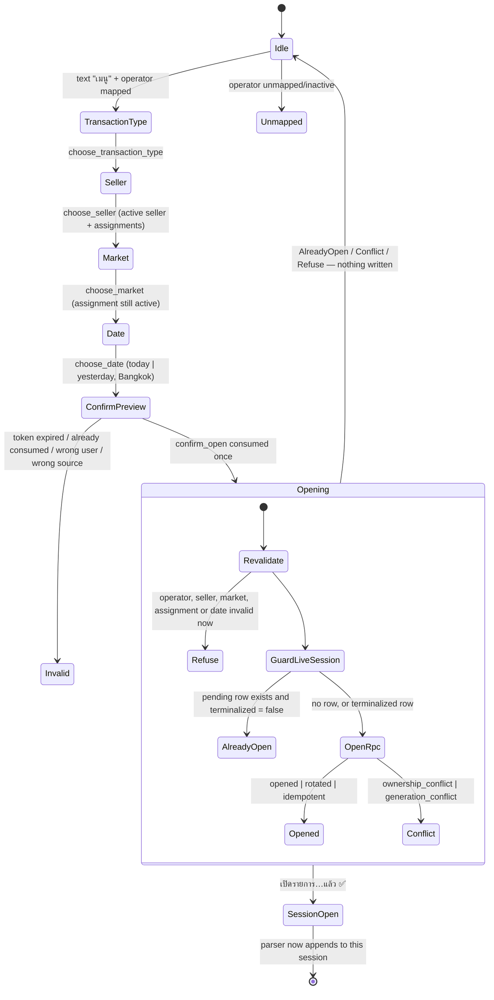
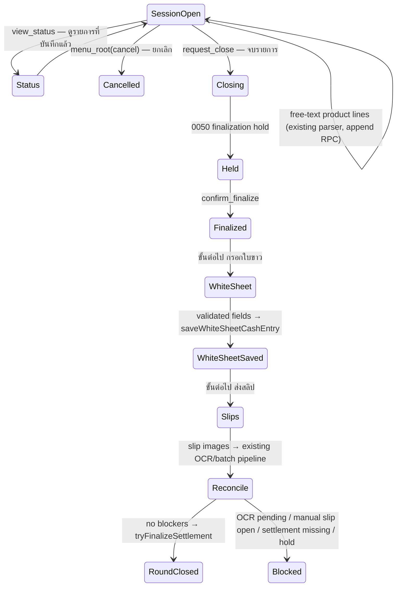

# Guided Operations — end-to-end LINE UX

One guided journey from `เมนู` to a closed round, built entirely on the
services, RPCs and barriers that already exist. This document records the
contracts that were **discovered** before any code was written, the state
machine those contracts imply, and the gaps where the requested design has no
authoritative implementation to reuse.

Base: PR #9 head `6b0089a973710a224e8511049231300cff4c1d92`
(`feat/guided-menu-seller-market-catalog-0055`, additive `0055` + strict
cleanup `0056`).

---

## 1. Discovery — what actually exists

### 1.1 Guided Menu state (0051 → 0055 → 0056)

| Concern | Contract | Where |
|---|---|---|
| Token | opaque `gpm1:` wire token; only the SHA-256 hash is stored | `menu-token.ts`, `line_menu_states.token_hash` |
| Create | `create_line_menu_state(p_token_hash, p_action_type, p_line_user_id, p_source_type, p_source_id, p_session_key, p_payload)` | 0051 |
| Consume | `consume_line_menu_state(...)` → `consumed` \| `replay` \| `already_consumed` \| `invalid_or_expired` | 0051, replaced by 0055 |
| Record | `record_line_menu_state_result(...)` → `recorded` \| `replay` \| `result_conflict` \| `invalid_or_expired` | 0051 |
| TTL | DB-authoritative: 30 min navigation, **10 min mutating** (`confirm_open`, `request_close`, `confirm_finalize`) | `guided_menu_ttl_interval` |
| Payload validation | `guided_menu_payload_valid(action, payload)` — exact key sets, active seller / active market / **active assignment** re-checked at consume time | 0055 → 0056 |
| Label safety | `line_menu_states_payload_no_trusted_labels` — payloads may never carry `staff_label` / `market_label` | 0051 |

Allowed `action_type` values after 0055:
`menu_root`, `choose_transaction_type`, `choose_seller`, `choose_market`,
`choose_date`, `confirm_open`, `view_status`, `request_close`,
`confirm_finalize`.

**Consequence for this epic:** the four guided capture actions of Slice 3B
(`ดูรายการที่บันทึกแล้ว`, `แก้ไข`, `ยกเลิก`, `จบรายการ`) map onto
`view_status` / `menu_root` / `request_close` / `confirm_finalize`, which
0051 already allows. Slices 3C and 3D need action types that do not exist
yet and therefore require a forward migration.

### 1.2 Pending / produce sessions

Two ways in, one storage model:

* **Legacy text** — a header line (`findProduceSessionHeader`) creates a
  `pending_sessions` row with `entry_origin IS NULL`; subsequent messages are
  appended as raw text; `จบรายการ` marks close.
* **Structured (0049)** — `ProduceSessionCommandService.execute({kind:"open"})`
  → `open_or_rotate_produce_structured_session`, which sets
  `entry_origin = 'structured_menu'` plus the frozen metadata
  (`business_date`, `transaction_time`, `transaction_time_source`,
  `staff_label`, `market_label`, `session_kind`, `initial_transaction_type`,
  `opened_line_event_id`).

Key invariants observed and reused:

* `staff_label` is **คนขาย — the seller**, not the operator. It becomes
  `produce_sessions.staff_name`. `market_label` becomes `session_title`.
* The canonical session key is derived by the RPC itself from the source
  triple and mirrors `getPendingSessionKey` exactly; a caller cannot name an
  arbitrary key.
* Ownership (`source_id`, `line_user_id`) is checked **before** the
  same-event idempotency shortcut, which is checked **before** any mutation.
* `p_expected_session_generation` gives optimistic concurrency.
* The RPC is open-**or-rotate**: reaching it with a live row silently discards
  that round. Guarding that is the caller's job (see §3.1).
* `terminalized = true` is the authoritative end state; 0050 sets it on every
  terminal path (finalized, failed_closed, duplicate, deadline elapsed).
* A text header arriving inside a structured session is refused before
  append/admit/ingest (`structured_header_refused`), and plain-text
  `จบรายการ` cannot close a structured session
  (`STRUCTURED_TEXT_CLOSE_REFUSED_REPLY`).

### 1.3 Parser

`parseWeighSession(text, businessDate)` with an optional `WeighSessionSeed`.
A seeded parse **starts in the item state**, so seeded metadata can never be
overwritten by a later text line. `initial_transaction_type` is the only
representation a guided `ชั่งคืน` / `คืนเสีย` main session has — there is no
textual section marker to recover it from.

Base transaction types: `เบิก`, `คืน`, `คืนเสีย` (note: the menu label is
`ชั่งคืน`, the stored base type is `คืน`).

### 1.4 Finalization barrier (0032 → 0050)

`close_produce_structured_session` (control event: no admission row, no
ingest row, no synthetic text) → readiness check
(`check_pending_close_ready`: admission/ingest **set** equality, not counts)
→ 0050 hold → `confirm_produce_structured_finalization` →
`try_finalize_pending_generation` → `produce_sessions` + notification outbox.

### 1.5 Digital White Sheet

Storage is `digital_white_sheet_cash_entries`, identity
**`(source_id, market_label_normalized, business_date)`**.

Operator-entered fields: `labor`, `location_fee`, `bag`, `snack`, `other`,
`other_note`, `actual_cash_submitted`. Everything else is computed by
`calculateDigitalWhiteSheet` from produce data — the LINE parser never
supplies arithmetic.

Lifecycle: `not_submitted` → `submitted` → `finalized`
(`finalize_white_sheet_cash_entry`, `reopen_white_sheet_cash_entry`,
audited in `white_sheet_lifecycle_events`). A FINALIZED sheet blocks the
operator upsert path.

**There is no seller column and no work-round column on the white sheet.**

### 1.6 Slips, settlement, reconciliation

* Evidence → `slip_evidences`; batches → `slip_batches`
  (`get_or_create_slip_batch`); checks → `slip_checks`; manual entries →
  `manual_slip_sessions` / `manual_slip_entries`.
* `reconcile()` and `loadMarketScopedAiVerifiedTransfers` /
  `loadMarketScopedManualSlipTotal` own the money definitions.
* `tryFinalizeSettlement` + `settlement_finalizations`
  (`source_id`, `business_date`, `line_retry_key`) own settlement closure.

### 1.7 LINE limits

`assertGuidedMenuMessageLimits` is the single authority: 1–5 reply messages,
text ≤ 5000 code points, buttons-template text ≤ 160 and ≤ 4 actions,
template/quick-reply labels ≤ 20 code points, Flex button labels ≤ 40, Flex
bubble ≤ 30 KiB UTF-8, postback data ≤ 300 chars and always a `gpm1:` token.

### 1.8 Migration numbering

Repo `main` ends at `0053_inventory_movement_ledger`. `0054` is **reserved
for P2D and is not consumed here**. `0055` / `0056` belong to PR #9. The next
free number for this epic is **0057**.

---

## 2. Gaps — where the requested design has no contract to reuse

These are recorded rather than invented. Nothing below was implemented by
guessing a business rule.

### 2.1 `work_rounds` is orphaned Production drift — **blocking for the requested Slice 3D shape**

| Object | Repo at PR #9 base | Production `apjjsqibavjaitcedavn` |
|---|---|---|
| `work_rounds` | no migration, **zero TypeScript references** | table exists, 19 rows, last write **2026-06-27** |
| `work_round_selections` | none | 11 rows, last write 2026-06-27 |
| `work_round_events` | none | **does not exist** |
| `produce_round_events` | none | 796 rows, last write 2026-06-27 |
| `produce_sessions.work_round_id` | not in repo schema | nullable column exists |
| `settlement_finalizations.work_round_id` | not in repo schema | nullable column exists |
| open/close-round RPC | none | only `claim_work_round_selection` — **no close or finalize function** |

Origin: the unmerged branch `feat/v2-work-round`, whose migrations
`0036_transaction_type_append` … `0040_v2_work_round_integrity` **collide by
number** with mainline `0036_additional_produce_entries` …
`0040_central_selling_prices`. Mainline `0036` names these objects explicitly
as things "the repo never declared".

Because there is no authoritative round lifecycle — nothing opens a round in
current code, and no function closes one — this epic **does not bind state to
`work_round_id`**. Guided state is instead bound to the tuple the live schema
actually keys on:

```
(source_id, line_user_id, seller, market, business_date, transaction_type,
 session_key, session_generation)
```

and persistence uses the existing keys: white sheet
`(source_id, market_label_normalized, business_date)`, settlement
`(source_id, business_date)`, slip batch as issued by
`get_or_create_slip_batch`. `produce_sessions.work_round_id` is left NULL, as
every row written since 2026-06-27 already is.

**Decision owner:** confirmed by the repository owner on 2026-07-30 —
"bind to (source, market, date), drop work_round". Reviving the v2 round
lifecycle remains an open, separate decision.

### 2.2 White sheet cannot record the seller

The guided flow knows the seller; `digital_white_sheet_cash_entries` has no
column for it. The sheet is therefore prefilled with market + business date
only, and the seller is carried in guided state for display and for the
produce session, not persisted onto the sheet. Adding a seller dimension to
the white sheet is a schema and reporting change beyond this epic.

### 2.3 Cold subsystems

`slip_batches` last wrote 2026-06-30, `settlement_entries` 2026-07-16,
`settlement_drafts` 2026-06-26, while `produce_sessions` is live
(2026-07-29). Slice 3D is built against these pipelines on the repository
owner's confirmation (2026-07-30) that they remain the operational route.

---

## 3. State machine

### 3.1 Slice 3A — confirmation opens a real session



Write points, in order, all fail-closed:

1. `consume_line_menu_state` — exactly once per token; a redelivered LINE
   event takes the `replay` branch and re-renders the recorded reply.
2. `pending_sessions` lookup — read only; a live row ends the flow with
   `session_already_open` and **zero writes**.
3. `open_or_rotate_produce_structured_session` — the only mutation, carrying
   the generation observed in step 2 so a concurrent rotation refuses instead
   of overwriting.
4. `record_line_menu_state_result` — stores the rendered reply for replay.

### 3.2 Slices 3B / 3C / 3D

Recorded here as the target once implemented; see §5 for delivery status.



Money definitions, reused verbatim, never recomputed:

```
checked_slip_total       = ai_verified_total + manual_slip_total
submitted_transfer_total = existing submitted money-transfer amount
difference               = submitted_transfer_total - checked_slip_total
```

---

## 4. Idempotency and security guarantees

| Property | Mechanism |
|---|---|
| One press = one write | `consume_line_menu_state` single-consume; the same LINE event id replays the recorded result |
| LINE webhook retry | replay branch at the menu layer, plus `opened_line_event_id` equality inside the open RPC |
| Stale button | DB TTL (10 min for mutating actions) + `already_consumed` → generic invalid reply |
| Revoked catalog row | `guided_menu_payload_valid` re-checks active seller / market / assignment at consume time; the handler re-reads the catalog again before opening |
| Cross-user replay | `consume_line_menu_state` binds `line_user_id`; the open RPC refuses `user_mismatch` |
| Cross-group replay | consume binds `source_type` + `source_id`; the open RPC derives the canonical key and refuses a mismatch |
| No label leakage | payloads carry codes only; the `no_trusted_labels` CHECK enforces it; labels are re-read from the catalog server-side |
| No silent data loss | live-session guard before the open-or-rotate RPC; optimistic generation on rotation |
| No exception leakage | every refusal path returns Thai operator copy; internal reasons stay in the recorded result and logs |

---

## 5. Delivery status

| Slice | Status |
|---|---|
| 3A — open real produce session | **delivered** |
| 3B — guided capture and finalize | see PR description |
| 3C — digital white sheet | see PR description |
| 3D — slips, reconciliation, close round | see PR description |

Production is untouched: no migration has been applied, no deployment made
and no LINE message sent from this work.

---

## 6. Rollout and rollback

**Rollout**

1. Merge PR #9 (`0055`, `0056`) and apply both to Production first — this
   epic's branch is stacked on them and `choose_seller` is not yet an allowed
   `action_type` in Production.
2. Deploy the application. Slice 3A is inert until an operator presses
   `ยืนยัน`; nothing changes for text-command users.
3. Verify with one real round in a pilot LINE group before widening.

**Rollback**

* Application-only rollback is sufficient for Slice 3A: it adds no migration
  and no column. Reverting the deploy restores the previous confirm-boundary
  placeholder, and any session already opened stays valid — it was opened
  through the same RPC the text flow uses and finalizes identically.
* No data migration is required in either direction.
